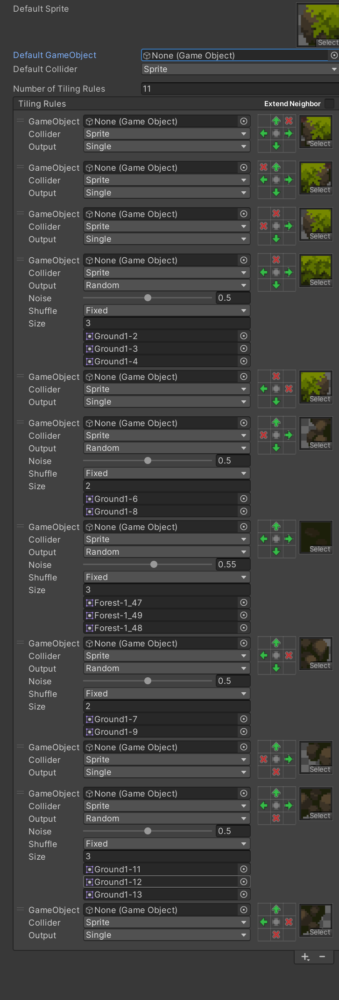

# AdventureProject

## ChapterOne瓦片地图

### 1.功能

> 1.将一些地图素材导入瓦片地图中，使用了Unity中RuleTile的功能，方便地图的绘制。
>
> 2.素材中有一些瀑布的地图素材，使用Unity的AnimatedTile功能，让瀑布流畅的运动起来。

### 2.方法

#### 2.1瓦片地图组件位置

> 1.瓦片地图的组件在unity的Windows--->2D--->TilePalette。

#### 2.2创建画布

>在TilePalette创建地图素材的画布
>
>将地图素材的SpriteMode从single改为multiple。
>
>Pixels Per Unit 改为16。
>
>filterMode改为Point。
>
>Compression改为None。
>
>注意：
>
>1.Unity2022.3.4f1版本可能会出现ArgumentException: Unable to set invalid palette错误，关闭重启可以解决。
>
>2.不同的素材有不同的修改，仅供参考
>
>3.创建画布会选择文件夹，TileMap--->Palette,创建tile文件夹然后再创建Palette文件夹存放画布

#### 2.3分割图片素材

> 1.点Sprite Editor--->slice--->type--->Grid by cell size--->apply.
>
> 2.将图片素材拖入创建好的Palette中。
>
> 注意：
>
> 1.分割地图的中点在center，分割人物和敌人的中心点是bottom。
>
> 2.拖入素材会让你再次创建文件夹，TileMap-->Tiles-->Forest。把素材保存到Forest文件夹中。

#### 2.4绘制瓦片地图

>1.在Hierarchy中创建2d Object -->TileMap-->Rectangular

#### 2.5规则瓦片

> 1.在Tile-->Tiles文件夹中创建RuleTile文件夹存放RuleTile。
>
> 2.Great-->2D-->Tiles--->RuleTile
>
> 3.设置好之后将RuleTile拖入Palette中。
>
> 

#### 2.6动画瓦片

>1.在Tile-->Tiles文件夹中创建AnimationTile文件夹存放AnimationTile。
>
>2.Great-->2D-->Tiles--->AnimatedTile
>
>3.设置好之后将AnimatedTile拖入Palette中。
>
>

# ChapterTwo角色基本功能

# ChapterFour角色UI的制作

## 4.1需求

>创建人物头像，人物血量UI，人物耐力条UI

## 4.2方法

### 4.2.1制作人物头像

>1.在层级窗口(Hierarchy)中创建UI-->Canvas
>
>注：1).在unity2022.3.13f1c1中选择UI中的Image会自动创建Canvas画布
>
>​        2).由于在不同的显示设备上UI可能会出现不同的显示效果，所以我们要将一些UI的锚点设置在左上方
>
>2.在Canvas下创建的一个空物体(PlayerStateBar)将PlayerStateBar的锚点设置到左上方，物体也移动到左上方
>
>3.在PlayerStateBar下创建Image(FaceBar)，在FaceBar中的inspector中Image组件中选择头像框
>
>注：FaceBar锚点不要改变，在PlayerStateBar的中心
>
>4.在FaceBar中创建一个Image(Cut)
>
>5.在Cut下创建一个Image(Face)
>
>6.在Face中的inspector中Image组件中选择角色Idle照片，大小改为400*400
>
>7.在Cut中添加Mask组件，取消勾选Show Mask Graphic
>
>8.最后把FaceBar调整到合适的位置

### 4.2.2制作人物的血量

>1.在PalyerStateBar下创建空物体(HealthBar)
>
>2.在HealthBar下创建Image(HealthFram)选择血量框
>
>3.在HealthBar下创建Image(HealthcolorGreen)选择血量绿色
>
>4.在HealthColorGreen中的inspector中Image组件中ImageType改为Filled，FilledMethod 改为 Horizontal
>
>4.在HealthBar下创建Image(HealthcolorRed)选择血量红色
>
>注意：如果血量显示有问题，调整血量的位置

### 4.2.3制作耐力框

>1.在PalyerStateBar下创建空物体(PowerBar)
>
>2.在HealthBar下创建Image(PowerFram)选择耐力框
>
>3.在HealthBar下创建Image(PowercolorYellow)选择黄色耐力条
>
>4.在PowercolorYellow中的inspector中Image组件中ImageType改为Filled，FilledMethod 改为 Horizontal

## 4.3成果展示

## 4.4代码详情

>Script-->UI